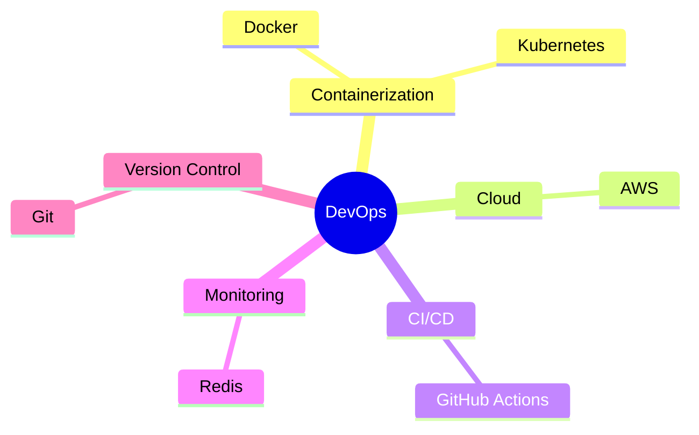

<h1 align="center">
  
</h1>

  

  

## 🚀 About Me

> DevOps enthusiast and full-stack developer passionate about building scalable solutions and automating workflows

- 🔭 Currently diving deep into **Cloud Computing** and **DevOps practices**
- 🌱 Learning advanced concepts in **Kubernetes** and **AWS**
- 👯 Looking to collaborate on innovative open-source projects
- 💡 Always excited to learn new technologies and best practices

## 💻 Tech Stack

  
  
  

  
  

### 🛠 DevOps & Tools

## 📊 Database Expertise
- MySQL
- PostgreSQL

## 🎯 LeetCode Stats

  <!-- Animated LeetCode Stats Header -->
  
  <!-- LeetCode Badges -->
  

    
    
  

  <!-- Main Stats Card with Heatmap -->
  
  <!-- Animated Problem Solved Distribution -->

## 🌐 Connect With Me

  
  
  

  📫 Reach me at: sathwikshetty2k5@example.com

## 📈 GitHub Activity

  

